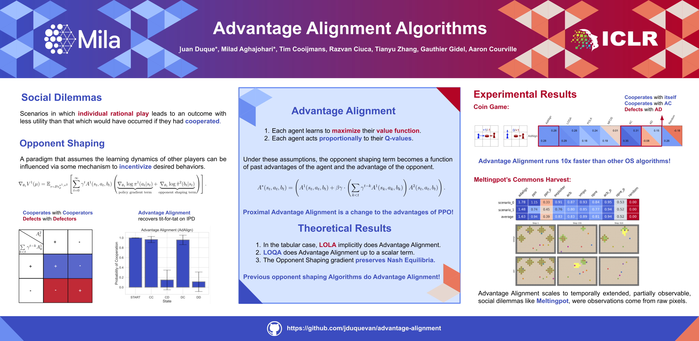

# Advantage Alignment Algorithms

## Juan Agustin Duque*,  Milad Aghajohari*, Tim Cooijmans, Razvan Ciuca, Tianyu Zhang, Gauthier Gidel, Aaron Courville



**Advantage Alignment Algorithms** introduces a novel family of opponent shaping methods that modify PPO’s advantage function to foster mutually beneficial strategies in multi-agent reinforcement learning. This repository provides implementations for both Advantage Alignment and its scalable variant, Proximal Advantage Alignment (PAA), along with experiments on environments for the Negotiation Game, and Melting Pot’s Commons Harvest Open. Paper: [link](https://arxiv.org/abs/2406.14662).

---

## Table of Contents

- [Overview](#overview)
- [Installation](#installation)
- [Usage](#usage)
- [Advantage Alignment Modification](#advantage-alignment-modification)
- [Citation](#citation)

---

## Overview

In many multi-agent scenarios, agents optimizing for individual rewards can lead to socially suboptimal outcomes. Our work tackles this by **aligning agents’ advantages**—i.e., modifying the standard advantage estimation in PPO to take into account the opponent’s advantage. This mechanism enables agents to steer their learning dynamics toward mutually beneficial equilibria.

---

## Installation

The repository is built using Python (>= 3.8). To install the required dependencies, run:

```bash
pip install -r requirements.txt
```

## Usage

This repository uses wandb and hydra, it also stores a replay buffer of past agent policies, agent checkpoints and evaluation videos. To start training, simply run the main training script:

```bash
python train.py wandb_dir_arg=path_to_wandb_dir memmap_dir_arg=path_to_memmap_dir hydra_run_dir_arg=path_to_hydra_dir video_dir_arg=path_to_video_dir checkpoint_dir_arg=path_to_save_dir
```
Make sure to create these directories in advance.

## Advantage Alignment Modification

The core contribution of this work is a modification to the standard PPO advantage. Instead of using only the agent’s advantage $A^1$, our method introduces a term based on the opponent’s advantage $A^2$ as follows:

$$
A^*(s_t, a_t, b_t) = A^1(s_t, a_t, b_t) + \beta\ \gamma\ \left(\sum_{k < t} \gamma^{t-k} A^1(s_k, a_k, b_k)\right) A^2(s_t, a_t, b_t)
$$

where:
- $A^1(s_t, a_t, b_t)$ is the standard advantage estimate for the agent.
- $A^2(s_t, a_t, b_t)$ represents the opponent’s advantage.
- $\gamma$ is the discount factor.
- $\beta$ is a scaling factor that adjusts the influence of the opponent's advantage.

This modified advantage $A^*$ is then substituted into the PPO surrogate objective, thereby guiding the agent toward actions that align its own advantages with those of its opponents.

---

## Citation

```bash
@misc{duque2025advantagealignmentalgorithms,
      title={Advantage Alignment Algorithms}, 
      author={Juan Agustin Duque and Milad Aghajohari and Tim Cooijmans and Razvan Ciuca and Tianyu Zhang and Gauthier Gidel and Aaron Courville},
      year={2025},
      eprint={2406.14662},
      archivePrefix={arXiv},
      primaryClass={cs.LG},
      url={https://arxiv.org/abs/2406.14662}, 
}
```
